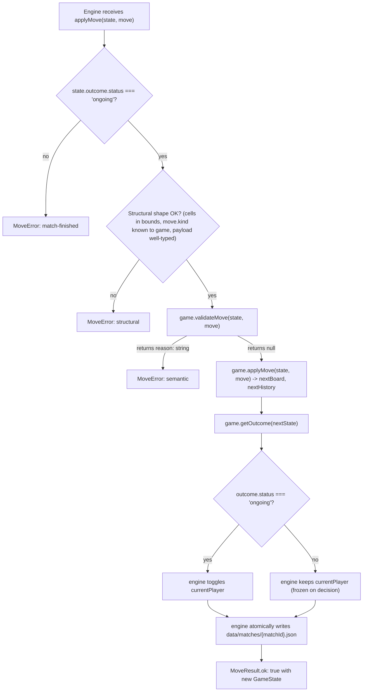

# ADR 0002 — The `GameDefinition` contract and the move flow

## Status

Accepted — 2026-05-26.

## Context

ADR 0001 settled the engine-vs-game split: the engine is game-agnostic, each
game implements a contract the engine consumes. This ADR pins down **what
that contract is** so Backend (iteration 6) and Frontend (iteration 6) can
implement against it without coming back with follow-up questions, and so
Architect's done criterion #3 ("Backend and Frontend can implement against
the contract without asking the Architect a follow-up question") is
verifiable.

The bootstrap prompt's section 4.3 listed five decisions that must reach an
ADR: the shape of `GameDefinition`, the shape of `GameState`, when the
engine validates a move, when the engine announces an outcome, and the file
format under `data/`. This ADR closes all five.

## Decision

### 1. Shape of `GameDefinition<TKind, TMove>`

Every game module under `packages/games/<game>/` exports a single object
implementing this interface (defined in
[`packages/engine/src/types.ts`](../../packages/engine/src/types.ts)):

```ts
interface GameDefinition<
  TKind extends string = string,
  TMove extends Move = Move,
> {
  readonly id: string;
  readonly displayName: string;
  readonly boardSize: BoardSize;
  readonly initialState:  (matchId: string)                         => GameState<TKind, TMove>;
  readonly validateMove:  (state: GameState<TKind, TMove>, move: TMove) => string | null;
  readonly applyMove:     (state: GameState<TKind, TMove>, move: TMove) => GameState<TKind, TMove>;
  readonly getOutcome:    (state: GameState<TKind, TMove>)              => Outcome;
}
```

Type variables:

- `TKind` — the union of piece kinds the game uses. Tic-tac-toe:
  `"x" | "o"`. Checkers: `"man" | "king"`.
- `TMove` — the discriminated union of move shapes (D9 in the action plan).
  Tic-tac-toe: `{ kind: "place"; cell: Cell }`.
  Checkers: `{ kind: "step"; from: Cell; to: Cell }
            | { kind: "capture"; from: Cell; to: Cell; captured: Cell }`.

Defaulting both type variables to the loosest constraint lets call sites
that do not care about the concrete game (e.g. the engine's persistence
layer) still reference `GameDefinition` and `GameState` without generics.

### 2. Shape of `GameState`

```ts
interface GameState<TKind, TMove> {
  readonly schemaVersion: 1;
  readonly gameId: string;
  readonly matchId: string;
  readonly board: Board<TKind>;        // ReadonlyArray<ReadonlyArray<Piece | null>>
  readonly currentPlayer: Player;      // "white" | "black"
  readonly outcome: Outcome;           // ongoing | win | draw
  readonly history: ReadonlyArray<TMove>;
}
```

`schemaVersion: 1` is a literal type. When the contract changes in a
breaking way, bump this number and have the engine refuse / migrate older
match files on load. This is a runtime safety net for D7 (one-file-per-match
JSON) so a stale match on disk can never be silently misinterpreted.

### 3. Move-validation flow (engine ↔ game)

The engine implements one entry point — `applyMove(state, move)` — which
executes the following six steps in order. Any failure short-circuits with a
typed `MoveError` and the on-disk state is **not** touched.



Step-by-step responsibilities:

| Step | Owner | What it checks                                                              |
| ---- | ----- | --------------------------------------------------------------------------- |
| 1    | engine | match is still `ongoing` — refuses moves on a decided match                 |
| 2    | engine | structural: cells in `[0, rows) × [0, cols)`, `move.kind` is a string, etc. |
| 3    | game  | semantic: is *this* move legal under *this* game's rules?                   |
| 4    | game  | how does the board change? returns next board + appends to history         |
| 5    | game  | did this move decide the match? pure function of board + history           |
| 6    | engine | toggles `currentPlayer` if still `ongoing`, persists to disk atomically    |

The two ADR-required moments answered:

- **When does the engine validate a move?** Structural validation runs in
  step 2 (engine). Semantic validation runs in step 3 (game). Both happen
  *before* anything is written to disk.
- **When does the engine announce victory?** Right after every successful
  `applyMove`, in step 5. The game decides; the engine routes.

### 4. File format under `data/`

`data/matches/{matchId}.json` contains exactly the JSON serialization of
`GameState`. Example for a tic-tac-toe match mid-play:

```json
{
  "schemaVersion": 1,
  "gameId": "tic-tac-toe",
  "matchId": "ttt-2026-05-26-abc123",
  "board": [
    [{ "owner": "white", "kind": "x" }, null, null],
    [null, { "owner": "black", "kind": "o" }, null],
    [null, null, null]
  ],
  "currentPlayer": "white",
  "outcome": { "status": "ongoing" },
  "history": [
    { "kind": "place", "cell": { "row": 0, "col": 0 } },
    { "kind": "place", "cell": { "row": 1, "col": 1 } }
  ]
}
```

Writes are atomic (D8): the engine writes to `{matchId}.json.tmp`, then
renames. Reads validate `schemaVersion` and reject anything other than `1`
until a migration is recorded in a follow-up ADR.

### 5. Game registry

The engine never imports a specific game. The app layer
(`apps/web/`) assembles the registry — a `Record<string, GameDefinition>`
keyed by `id` — by importing each game module at load time. Iteration 6
will pin down the exact shape (likely
`apps/web/app/lib/games.ts` exporting a frozen registry). This ADR records
the *responsibility* (apps/web owns the registry, not the engine); the
*placement* is a Backend detail Backend can resolve without a follow-up
ADR.

## Alternatives considered

### Alt A — Move enumeration API (`legalMoves(state): TMove[]`)

The game returns the full list of legal moves on demand; the UI picks one.

Rejected because:

- Checkers' captures (chains of mandatory jumps) and chess-class games have
  large or context-dependent move spaces. Enumerating them on every UI
  hover or render is wasteful.
- Asking `validateMove` on submission is O(1) for the rules we care about
  and matches how a human plays the game (think, then commit).
- Backend done criterion #3 ("the same engine runtime serves tic-tac-toe
  and checkers without conditional branches keyed on game id") is harder to
  honor if move enumeration semantics differ per game.

A future "show me legal targets" UI affordance can be added as an
*optional* `getLegalTargets(state, from)` method on the contract without
breaking existing games. Recorded here as a possible follow-up ADR.

### Alt B — Class-based contract

`abstract class Game { abstract validateMove(...) }; class Checkers extends Game { … }`.

Rejected because:

- A class instance does not survive JSON round-trips, which kills D7
  (state as readable JSON on disk).
- The engine would need a factory to rehydrate a `Game` per match, which
  hides the contract behind an indirection.
- The plain interface form fits on one slide; the class form does not.

### Alt C — JSON-Schema-driven contract

Games declare moves as JSON Schemas; the engine validates moves at runtime
against the schema.

Rejected because:

- Adds a runtime schema validator (e.g. `ajv`) as a dependency, which
  contradicts D11 (no extra moving parts) and the bootstrap prompt's "zero
  external paid APIs / minimal deps" stance.
- TypeScript discriminated unions already give us structural validation at
  the type-check stage. Runtime safety at the persistence boundary is
  enough.

### Alt D — Two separate methods: `tryApplyMove` and `getOutcome` both on the engine

The engine owns both legality and outcome detection; games hand it raw
state.

Rejected because:

- This is Alt B of ADR 0001 in disguise: the engine would need a switch on
  `gameId`. ADR 0001 already rejected that.

## Consequences

### Positive

- **One-screen contract.** A complete `GameDefinition` is ~10 lines of TS;
  a complete game is 30–80 lines. Fits on slide 7 of the deck.
- **No game-specific code in the engine.** Iteration 7's DoD ("diff
  względem iteracji 6 nie dotyka `packages/engine/`") is structurally
  enforced — the engine's source has no `gameId` branches by construction.
- **Backend and Frontend can start work independently of each other.**
  Both depend only on `@game-engine/engine` types; neither blocks the
  other.
- **JSON-on-disk works out of the box.** `GameState` is plain data; no
  custom serializer needed.

### Negative

- **Error reasons live in English on the game side.** `validateMove`
  returns `string | null`. Translation, if needed for the UI, is a
  Frontend concern. Acceptable for the workshop's PL/EN split.
- **No undo built in.** History is append-only; an "undo last move" UI
  would need either a fresh ADR (mutating history) or replaying from
  `initialState`. Not in scope for the workshop.
- **Schema migrations are a real obligation.** Any breaking change to
  `GameState` requires bumping `schemaVersion` and writing a migration ADR.
  This is intentional friction; D7 (human-readable JSON on disk) is worth
  the cost.

## References

- Type contract: [`packages/engine/src/types.ts`](../../packages/engine/src/types.ts).
- Action plan: `workshop/plan/01-action-plan.md` — decisions D7, D8, D9,
  D10; iterations 5, 6, 7.
- Bootstrap prompt: `workshop/plan/00-bootstrap-prompt.md` — section 4.3.
- Prior: ADR 0001 — engine vs game split.
